<p align="center">
  
  
  
  
</p>

<h1 align="center">🚀 AutoDev</h1>
<h3 align="center">AI-Powered Codebase Onboarding Platform — Built for Bharat</h3>
<p align="center"><i>"Onboard new developers in hours, not weeks. In their own language."</i></p>

<p align="center">
  
  
  
  
  
  
  
  
</p>

---

## 📋 Table of Contents

- [The Problem](#-the-problem)
- [The Solution](#-the-solution)
- [Live Demo](#-live-demo)
- [System Architecture](#-system-architecture)
- [Data Flow](#-data-flow)
- [Package Structure](#-package-structure)
- [Key Features](#-key-features)
- [Tech Stack](#-tech-stack)
- [API Reference](#-api-reference)
- [Database Schema](#-database-schema)
- [Getting Started](#-getting-started)
- [Supported Languages](#-supported-languages)
- [Milestones](#-milestones)
- [Why AutoDev for India](#-why-autodev-for-india)
- [Competitive Landscape](#-competitive-landscape)
- [Team](#-team)

---

## 🇮🇳 The Problem

> **New developers waste 2–4 weeks understanding unfamiliar codebases.**

India has **4.3 million developers** — yet the onboarding experience is broken:

- 🔴 **83%** of engineering graduates struggle without senior mentors
- 🔴 Service companies rotate developers across projects every 6–12 months
- 🔴 Existing tools (CodeRabbit, Greptile, Qodo) focus on **code review**, not **learning**
- 🔴 **Zero** tools explain code in Indian languages — Hindi, Tamil, Telugu, Kannada, Bengali, Marathi
- 🔴 Average onboarding cost: **₹2–5 lakhs per developer** per project rotation

---

## 💡 The Solution

**AutoDev** is the first platform purpose-built for **developer onboarding as learning** — not code search or PR review. Install it on any GitHub repo and get instant onboarding intelligence.

| Feature | What It Does |
|---|---|
| 🗺️ **Animated Architecture Maps** | Watch request flows light up node-by-node — understand how the system works |
| 🤖 **Environment Setup Autopilot** | AI-generated setup guide that flags conflicts and missing docs — Day 1 in 10 minutes |
| 🌐 **Multi-Language Explanations** | "Explain auth like I'm a fresher" — in Hindi, Tamil, Telugu, or English |
| 📈 **Learning Progress Dashboard** | Track understanding: "0% to 80% in 2 hours" with skill radar charts |
| 🧭 **Guided Walkthroughs** | Step-by-step code tours auto-generated from AI analysis |
| 💬 **Codebase Q&A** | Ask questions in natural language, get answers with file references |
| 🔍 **Convention Detection** | Visual cards showing coding patterns and standards used in the repo |
| 🎙️ **Voice Q&A** | Audio-based code explanations — accessibility first |
| 🤝 **AI Copilot** | Context-aware coding assistance inside the platform |
| 👥 **Team Leaderboard** | Track onboarding progress across the entire team |

---

## 🎬 Live Demo

> **"A fresher joins a company. In 10 minutes: animated system map, AI explanations in their language, verified setup guide, and a learning path. 2 weeks → 2 hours."**

```bash
# Run locally in demo mode (no AWS required)
pnpm --filter @autodev/backend dev &
pnpm --filter @autodev/frontend dev

# Open demo dashboard
open http://localhost:3000/dashboard?demo=true
```

**Demo Repos included:** `express-shop` (Node.js e-commerce), `react-dashboard` (React BI), `python-ml-api` (Python ML)

---

## 🏛️ System Architecture

```mermaid
graph TB
    subgraph CLIENT["🖥️ Client Layer"]
        style CLIENT fill:#1a1a2e,stroke:#4361EE,stroke-width:2px,color:#fff
        FE["🌐 Next.js 14<br/>Web Dashboard"]
        VS["🔵 VS Code<br/>Extension"]
        GH["⚫ GitHub App<br/>Probot"]
    end

    subgraph API["⚙️ API Layer"]
        style API fill:#16213e,stroke:#7209B7,stroke-width:2px,color:#fff
        BE["🚀 Express.js Backend<br/>TypeScript + Lambda"]
    end

    subgraph AI["🧠 AI Layer — AWS Bedrock"]
        style AI fill:#0f3460,stroke:#F72585,stroke-width:2px,color:#fff
        CS["Claude 3.5 Sonnet<br/>Architecture & Walkthroughs"]
        CH["Claude 3 Haiku<br/>Conventions & i18n"]
        TE["Titan Embeddings V2<br/>Semantic Search"]
    end

    subgraph DATA["💾 Data Layer"]
        style DATA fill:#1a1a2e,stroke:#06D6A0,stroke-width:2px,color:#fff
        DB["🗄️ DynamoDB<br/>repos · analyses · cache<br/>progress · walkthroughs"]
        S3["🪣 S3 Buckets<br/>repo-files · analysis-results"]
    end

    FE -->|REST API| BE
    VS -->|REST API| BE
    GH -->|Webhooks & REST| BE
    BE -->|Invoke Models| CS
    BE -->|Invoke Models| CH
    BE -->|Generate Embeddings| TE
    BE -->|Read/Write| DB
    BE -->|Store/Fetch| S3
    GH -->|Fetch Repo Files| S3

    style FE fill:#4361EE,color:#fff
    style VS fill:#0078D4,color:#fff
    style GH fill:#333,color:#fff
    style BE fill:#7209B7,color:#fff
    style CS fill:#FF6B35,color:#fff
    style CH fill:#F72585,color:#fff
    style TE fill:#4CC9F0,color:#000
    style DB fill:#06D6A0,color:#000
    style S3fill:#FFD166,color:#000
```

---

## 🔄 Data Flow

### End-to-End Onboarding Pipeline

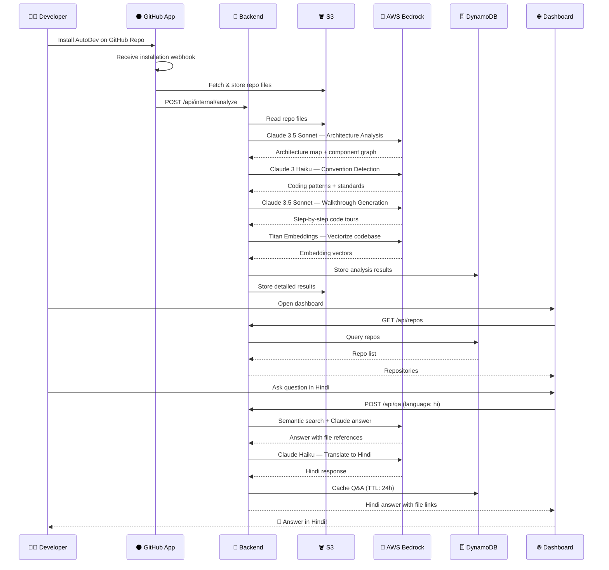

### Architecture Analysis Flow

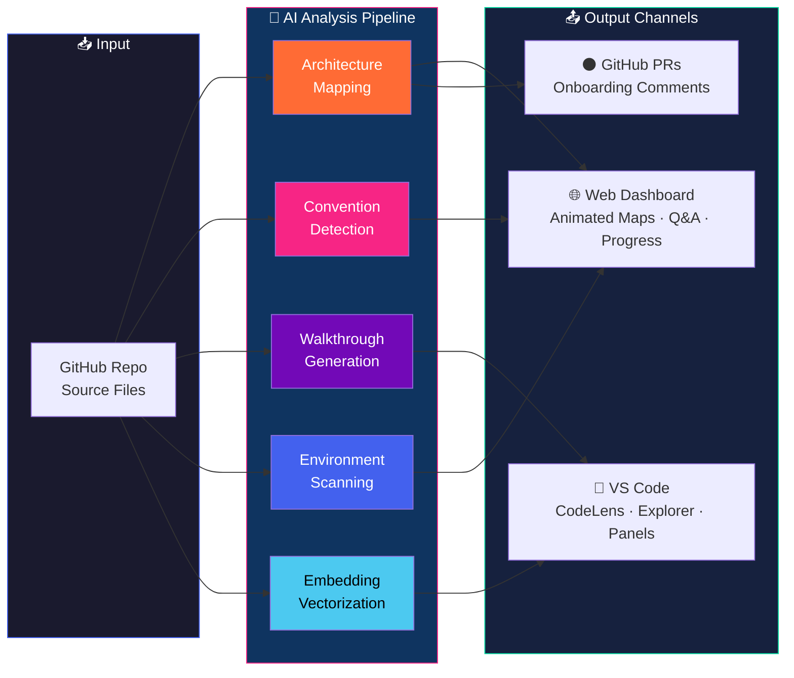

---

## 📦 Package Structure

```mermaid
graph TD
    ROOT["🏠 AutoDev Monorepo<br/>(pnpm workspaces)"]

    ROOT --> FE["📦 packages/frontend<br/>Next.js 14 Dashboard"]
    ROOT --> BE["📦 packages/backend<br/>Express.js API + Lambda"]
    ROOT --> GHA["📦 packages/github-app<br/>Probot GitHub App"]
    ROOT --> VSC["📦 packages/vscode-extension<br/>VS Code Extension"]
    ROOT --> SH["📦 packages/shared<br/>TypeScript Types"]
    ROOT --> INF["📁 infrastructure/<br/>AWS SAM Template"]

    FE --> FE1["app/page.tsx — Landing Page"]
    FE --> FE2["app/dashboard/ — Repo List"]
    FE --> FE3["app/dashboard/[repoId]/ — Per-Repo"]
    FE3 --> FE3A["animated/ — Animated Maps"]
    FE3 --> FE3B["walkthroughs/ — Code Tours"]
    FE3 --> FE3C["qa/ — Q&A Chat"]
    FE3 --> FE3D["progress/ — Skills Dashboard"]
    FE3 --> FE3E["env-setup/ — Setup Autopilot"]
    FE3 --> FE3F["conventions/ — Code Patterns"]
    FE3 --> FE3G["canvas/ — Architecture Canvas"]
    FE3 --> FE3H["team/ — Team Leaderboard"]

    BE --> BE1["routes/ — 14 API endpoints"]
    BE --> BE2["services/ — 11 services"]
    BE --> BE3["prompts/ — AI prompts"]
    BE1 --> BE1A["analysis · qa · walkthroughs"]
    BE1 --> BE1B["animated · conventions · envSetup"]
    BE1 --> BE1C["skillTracker · voice · copilot · i18n"]
    BE2 --> BE2A["bedrock · dynamodb · s3"]
    BE2 --> BE2B["analysisOrchestrator · progressTracker"]
    BE2 --> BE2C["semanticSearch · embeddings · i18n · voice"]

    GHA --> GHA1["handlers/ — installation, PR, push"]
    GHA --> GHA2["services/ — repoFetcher"]

    VSC --> VSC1["panels/ — CodebaseExplorer, QAPanel"]
    VSC --> VSC2["panels/ — WalkthroughPanel, ProgressPanel"]
    VSC --> VSC3["providers/ — CodeLens"]
    VSC --> VSC4["api/ — Backend client"]

    style ROOT fill:#FF6B35,color:#fff
    style FE fill:#4361EE,color:#fff
    style BE fill:#7209B7,color:#fff
    style GHA fill:#333,color:#fff
    style VSC fill:#0078D4,color:#fff
    style SH fill:#06D6A0,color:#000
    style INF fill:#FFD166,color:#000
```

### Directory Tree

```
autodev/
├── packages/
│   ├── frontend/                      # 🌐 Next.js 14 Dashboard
│   │   └── src/
│   │       ├── app/
│   │       │   ├── page.tsx           # Landing page (hero, features, CTA)
│   │       │   ├── sign-in/           # Auth: sign in
│   │       │   ├── sign-up/           # Auth: sign up
│   │       │   ├── demo/              # Demo guided walkthrough
│   │       │   └── dashboard/
│   │       │       ├── page.tsx       # Repository list
│   │       │       └── [repoId]/
│   │       │           ├── page.tsx          # Repo overview
│   │       │           ├── animated/         # Animated architecture maps
│   │       │           ├── canvas/           # Interactive architecture canvas
│   │       │           ├── conventions/      # Coding conventions viewer
│   │       │           ├── env-setup/        # Environment Setup Autopilot
│   │       │           ├── qa/               # Q&A chat interface
│   │       │           ├── walkthroughs/     # Guided code tours
│   │       │           ├── progress/         # Individual skill radar
│   │       │           └── team/             # Team progress leaderboard
│   │       ├── components/            # 29 shared UI components
│   │       ├── hooks/                 # Custom React hooks
│   │       └── lib/                   # API client, utilities
│   │
│   ├── backend/                       # 🚀 Express.js API + Lambda
│   │   └── src/
│   │       ├── index.ts               # App entry + route registration
│   │       ├── routes/
│   │       │   ├── analysis.ts        # Trigger/retrieve AI analysis
│   │       │   ├── animated.ts        # Animated flow sequences
│   │       │   ├── conventions.ts     # Convention detection results
│   │       │   ├── copilot.ts         # AI coding copilot
│   │       │   ├── demo.ts            # Demo mode (no AWS needed)
│   │       │   ├── envSetup.ts        # Environment autopilot
│   │       │   ├── i18n.ts            # Multi-language translation
│   │       │   ├── internal.ts        # Internal trigger endpoints
│   │       │   ├── qa.ts              # Natural language Q&A
│   │       │   ├── repos.ts           # Repository management
│   │       │   ├── skillTracker.ts    # Learning progress API
│   │       │   ├── voice.ts           # Voice Q&A endpoint
│   │       │   ├── walkthroughs.ts    # Guided walkthrough API
│   │       │   └── webhook.ts         # GitHub webhook handler
│   │       ├── services/
│   │       │   ├── analysisOrchestrator.ts  # Master AI pipeline
│   │       │   ├── bedrock.ts               # AWS Bedrock client
│   │       │   ├── cache.ts                 # DynamoDB TTL cache
│   │       │   ├── dynamodb.ts              # DynamoDB CRUD
│   │       │   ├── embeddings.ts            # Titan Embeddings
│   │       │   ├── envAnalyzer.ts           # Env conflict detection
│   │       │   ├── i18n.ts                  # Translation service
│   │       │   ├── progressTracker.ts       # Skill tracking engine
│   │       │   ├── s3.ts                    # S3 file storage
│   │       │   ├── semanticSearch.ts        # Vector similarity search
│   │       │   └── voice.ts                 # Voice synthesis
│   │       ├── prompts/               # AI prompt templates (5 files)
│   │       └── middleware/            # Auth, error handling
│   │
│   ├── github-app/                    # ⚫ Probot GitHub App
│   │   └── src/
│   │       ├── index.ts               # App entry + event registration
│   │       ├── handlers/
│   │       │   ├── installation.ts    # Repo install → trigger analysis
│   │       │   ├── pullRequest.ts     # PR opened → onboarding comment
│   │       │   └── push.ts            # Push → re-analyze changed files
│   │       └── services/
│   │           └── repoFetcher.ts     # GitHub API → S3 storage
│   │
│   ├── vscode-extension/              # 🔵 VS Code Extension
│   │   └── src/
│   │       ├── extension.ts           # Main activation + command registration
│   │       ├── panels/
│   │       │   ├── CodebaseExplorerPanel.ts  # Architecture tree
│   │       │   ├── QAPanel.ts                # Q&A webview
│   │       │   ├── WalkthroughPanel.ts       # Step-by-step tours
│   │       │   └── ProgressPanel.ts          # Skill progress view
│   │       ├── providers/
│   │       │   └── CodeLensProvider.ts       # Inline file annotations
│   │       └── api/
│   │           └── client.ts                 # Backend API client
│   │
│   └── shared/                        # 📐 Shared TypeScript Types
│       └── src/types/
│           ├── repo.ts                # Repository types
│           ├── analysis.ts            # Analysis result types
│           └── user.ts                # User & progress types
│
├── infrastructure/
│   └── template.yaml                  # AWS SAM: Lambda + API GW + DynamoDB + S3
├── SPEC.md                            # Milestone specifications
├── pnpm-workspace.yaml                # Monorepo config
└── tsconfig.base.json                 # Shared TypeScript config
```

---

## ✨ Key Features

### 1. 🗺️ Animated Architecture Maps

Interactive React Flow diagrams where nodes **light up in sequence** showing how requests flow through the system.

```mermaid
graph LR
    A["👆 User Click"] -->|trigger| B["🔀 API Gateway"]
    B --> C["🔒 Auth Middleware"]
    C --> D["✅ JWT Validation"]
    D --> E["🗄️ DB Lookup"]
    E --> F["⚙️ Service Layer"]
    F --> G["📦 Controller"]
    G --> H["✅ Response"]

    style A fill:#06D6A0,color:#000
    style B fill:#4361EE,color:#fff
    style C fill:#F72585,color:#fff
    style D fill:#7209B7,color:#fff
    style E fill:#4CC9F0,color:#000
    style F fill:#FF6B35,color:#fff
    style G fill:#FFD166,color:#000
    style H fill:#06D6A0,color:#000
```

- ✅ Nodes highlight one-by-one with animated edges
- ✅ Click any node to pause and get AI explanation
- ✅ Per-module walkthroughs: "Auth System", "Data Pipeline", "Frontend Layer"
- ✅ Auto-generated from codebase analysis via AWS Bedrock

---

### 2. 🤖 Environment Setup Autopilot

AI scans the repo and generates a **verified setup guide** — not a stale README.

```
┌─────────────────────────────────────────────────────┐
│  🤖 Environment Setup Autopilot                      │
├─────────────────────────────────────────────────────┤
│  ✅ Node.js 18.x required (.nvmrc detected)         │
│  ✅ pnpm 8.x required (packageManager field)        │
│  ⚠️  CONFLICT: README says Node 16, package.json    │
│     engines requires Node 18                         │
│  ✅ Docker Compose detected (3 services)             │
│  ❌ MISSING: .env.example exists but no Redis        │
│     setup docs (docker-compose uses Redis)           │
│  ✅ 8 setup steps generated                          │
│                                                      │
│  Estimated setup time: 10 minutes                    │
│  (vs. average 1-3 days without AutoDev)              │
└─────────────────────────────────────────────────────┘
```

---

### 3. 🌐 Multi-Language Q&A (Bharat-First)

Code explanations in **Hindi, Tamil, Telugu, Kannada, Bengali, Marathi** — because 83% of Indian graduates learn better in their native language.

```
┌─────────────────────────────────────────────────────┐
│  🌐 Language: हिंदी (Hindi)                   [▼]  │
├─────────────────────────────────────────────────────┤
│                                                      │
│  Q: "Auth module kaise kaam karta hai?"              │
│                                                      │
│  A: "Yeh authentication module JWT tokens ka         │
│  use karta hai. Jab user login karta hai,            │
│  server ek token generate karta hai jo               │
│  24 ghante tak valid rehta hai. Har API              │
│  request mein yeh token header mein bheja            │
│  jaata hai aur middleware verify karta hai."          │
│                                                      │
│  📁 src/middleware/auth.ts, src/services/jwt.ts      │
└─────────────────────────────────────────────────────┘
```

---

### 4. 📈 Learning Progress Dashboard

Real-time skill tracking with **measurable onboarding metrics**.

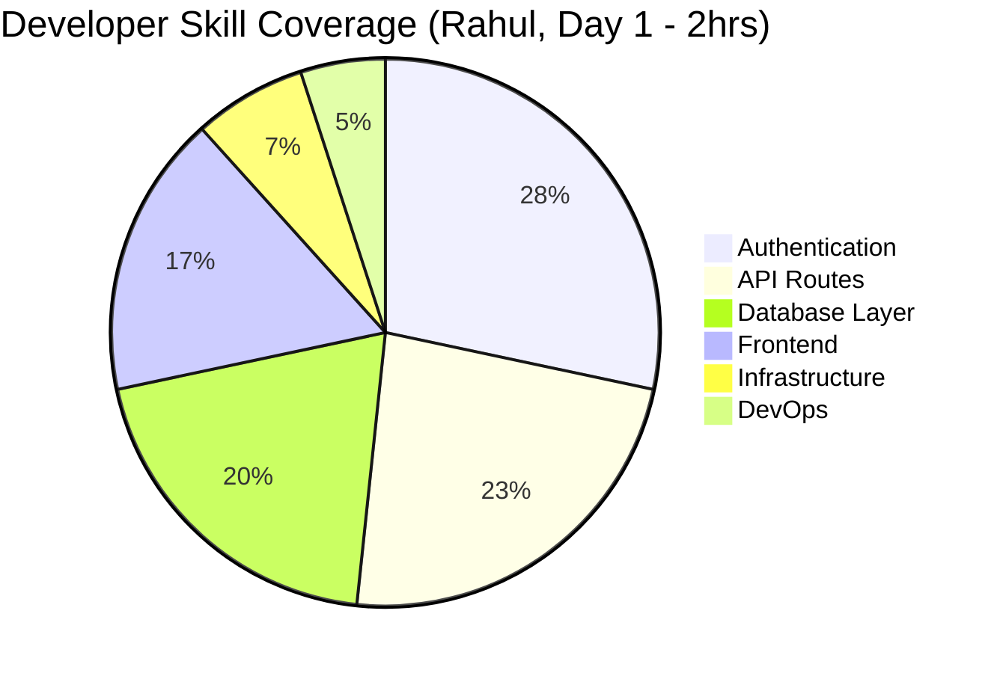

- ✅ Questions asked, walkthroughs completed, time spent
- ✅ Skill radar chart per module
- ✅ "Ready for first contribution" recommendation
- ✅ Team leaderboard across all developers

---

### 5. 🎙️ Voice Q&A

Accessibility-first voice interface for code explanations. Developers can **speak their question** and receive an **audio response** powered by AWS Polly + Bedrock.

---

### 6. 🤝 AI Copilot

Context-aware coding assistant embedded directly in the dashboard — powered by Claude 3.5 Sonnet with full repo context.

---

## 🛠️ Tech Stack

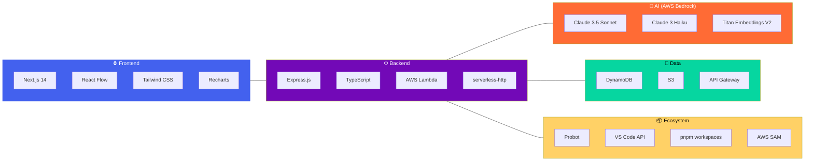

| Layer | Technology | Purpose |
|---|---|---|
| **Frontend** | Next.js 14, React Flow, Tailwind CSS, Recharts | Web dashboard: animated maps, Q&A, progress tracking |
| **VS Code** | TypeScript, React Webviews, VS Code API | IDE-integrated onboarding: CodeLens, panels, explorer |
| **GitHub App** | Probot Framework, Webhooks | Auto-analyze repos on install, PR onboarding comments |
| **Backend** | Express.js + TypeScript, serverless-http | REST API, AI orchestration, caching, progress tracking |
| **AI Models** | Claude 3.5 Sonnet | Architecture analysis, walkthroughs, complex Q&A |
| **AI Models** | Claude 3 Haiku | Conventions, env setup, i18n translations, quick replies |
| **AI Models** | Titan Embeddings V2 | Semantic search, vector similarity, Q&A retrieval |
| **Database** | AWS DynamoDB | Repos, analyses, Q&A cache (TTL), progress, walkthroughs |
| **Storage** | AWS S3 | Raw repo files, analysis results, embeddings |
| **Infrastructure** | AWS Lambda + API Gateway + SAM | Serverless deployment, auto-scaling |
| **Monorepo** | pnpm workspaces | Unified package management across 5 packages |

---

## 🔌 API Reference

### Core Endpoints

| Method | Endpoint | Description |
|---|---|---|
| `GET` | `/health` | Service health check |
| `GET` | `/api/warmup` | Pre-warm services, check AWS readiness |
| `GET` | `/api/repos` | List all connected repositories |
| `POST` | `/api/repos` | Register a new repository |
| `POST` | `/api/analysis/trigger` | Trigger full AI analysis for a repo |
| `GET` | `/api/analysis/:owner/:repo` | Get latest analysis results |
| `POST` | `/api/qa/:owner/:repo` | Ask a question in natural language |
| `GET` | `/api/walkthroughs/:owner/:repo` | Get generated walkthroughs |
| `GET` | `/api/animated/:owner/:repo/sequences` | Get animated flow sequences |
| `GET` | `/api/conventions/:owner/:repo` | Get detected code conventions |
| `GET` | `/api/env-setup/:owner/:repo` | Get environment setup guide |
| `GET` | `/api/progress/:owner/:repo` | Get developer learning progress |
| `GET` | `/api/progress/:owner/:repo/team` | Get team progress leaderboard |
| `POST` | `/api/voice/:owner/:repo` | Voice Q&A (speech → answer → audio) |
| `POST` | `/api/copilot/:owner/:repo` | AI copilot assistance |
| `POST` | `/api/i18n/translate` | Translate content to Indian languages |

### Demo Endpoints (No AWS Required)

| Method | Endpoint | Description |
|---|---|---|
| `GET` | `/api/demo/repos` | List demo repositories |
| `GET` | `/api/demo/analysis/:owner/:repo/architecture` | Demo architecture data |
| `GET` | `/api/demo/animated/:owner/:repo/sequences` | Demo animated sequences |
| `POST` | `/api/demo/qa/:owner/:repo` | Demo Q&A (canned responses) |
| `GET` | `/api/demo/progress/:owner/:repo/team` | Demo team progress + leaderboard |

---

## 🗄️ Database Schema

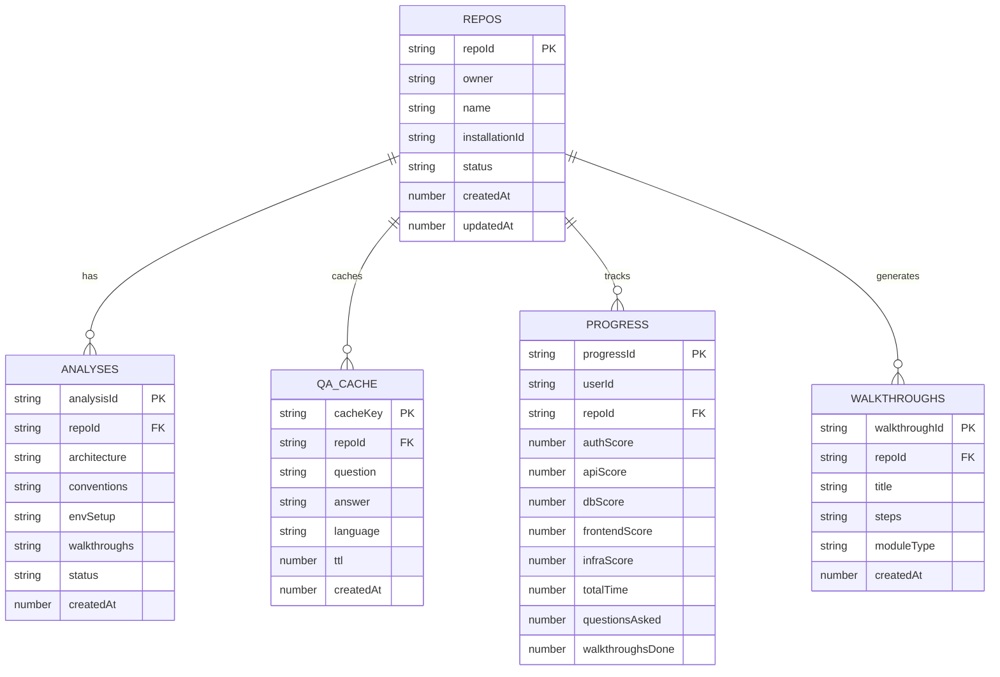

---

## 🚀 Getting Started

### Prerequisites

- Node.js 18+
- pnpm 8+
- AWS account with Bedrock access (region: `us-east-1`)
- GitHub account (for GitHub App)

### 1. Clone & Install

```bash
git clone https://github.com/your-username/autodev.git
cd autodev

# Install all dependencies across all packages
pnpm install

# Build shared types first
pnpm --filter @autodev/shared build
```

### 2. Environment Setup

**Backend** (`packages/backend/.env`):
```env
# AWS
AWS_ACCESS_KEY_ID=your_key
AWS_SECRET_ACCESS_KEY=your_secret
AWS_REGION=us-east-1

# DynamoDB Tables
DYNAMODB_REPOS_TABLE=autodev-repos
DYNAMODB_ANALYSES_TABLE=autodev-analyses
DYNAMODB_QA_CACHE_TABLE=autodev-qa-cache
DYNAMODB_PROGRESS_TABLE=autodev-progress
DYNAMODB_WALKTHROUGHS_TABLE=autodev-walkthroughs

# S3 Buckets
S3_REPO_FILES_BUCKET=autodev-repo-files
S3_ANALYSIS_RESULTS_BUCKET=autodev-analysis-results

# GitHub
GITHUB_APP_ID=your_app_id
GITHUB_PRIVATE_KEY=your_private_key
GITHUB_WEBHOOK_SECRET=your_webhook_secret
```

**Frontend** (`packages/frontend/.env.local`):
```env
NEXT_PUBLIC_API_URL=http://localhost:3001
```

### 3. AWS Services Setup

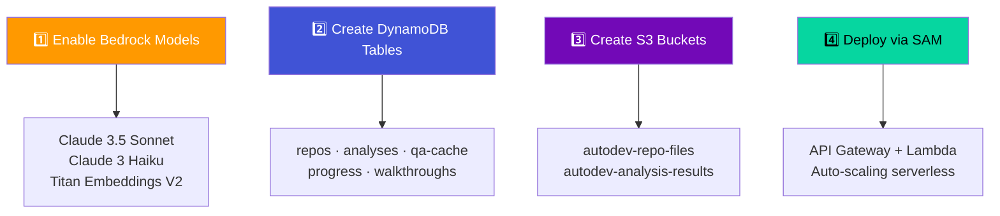

### 4. Run Locally

```bash
# Terminal 1: Start backend (port 3001)
pnpm --filter @autodev/backend dev

# Terminal 2: Start frontend (port 3000)
pnpm --filter @autodev/frontend dev

# Terminal 3: Start GitHub App (port 3002)
pnpm --filter @autodev/github-app dev

# OR run everything at once
pnpm dev
```

### 5. Demo Mode (No AWS Needed)

```bash
# Run with demo data — no credentials required
open http://localhost:3000/dashboard?demo=true
```

---

## 🌐 Supported Languages

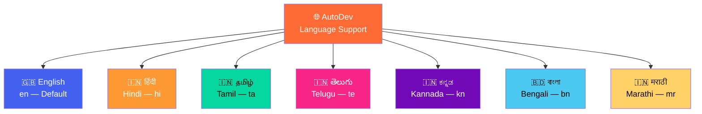

---

## 🏁 Milestones

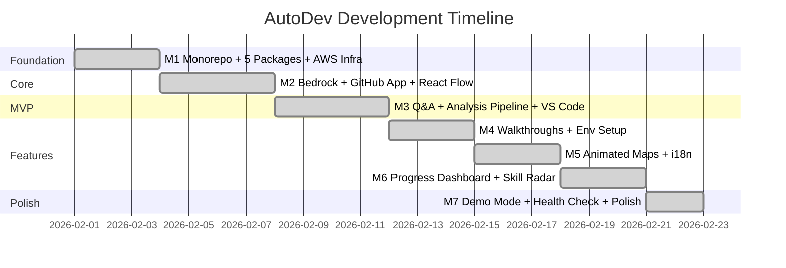

| # | Milestone | Status | Key Deliverables |
|---|---|:---:|---|
| M1 | **Foundation** | ✅ | Monorepo, all 5 packages, AWS SAM infra template, shared types |
| M2 | **Core Integration** | ✅ | Bedrock AI client, GitHub App events, React Flow architecture maps |
| M3 | **MVP End-to-End** | ✅ | Natural language Q&A, full analysis pipeline, VS Code extension base |
| M4 | **Walkthroughs + Env Setup** | ✅ | Guided code tours, convention detection, environment autopilot |
| M5 | **Animated Maps + i18n** | ✅ | Animated step-by-step walkthroughs, 7-language support |
| M6 | **Progress Dashboard** | ✅ | Skill radar charts, learning progress, team leaderboard |
| M7 | **Demo Day Ready** | ✅ | Demo mode (no AWS), guided demo script, voice Q&A, AI copilot, health checks |

---

## 🇮🇳 Why AutoDev for India

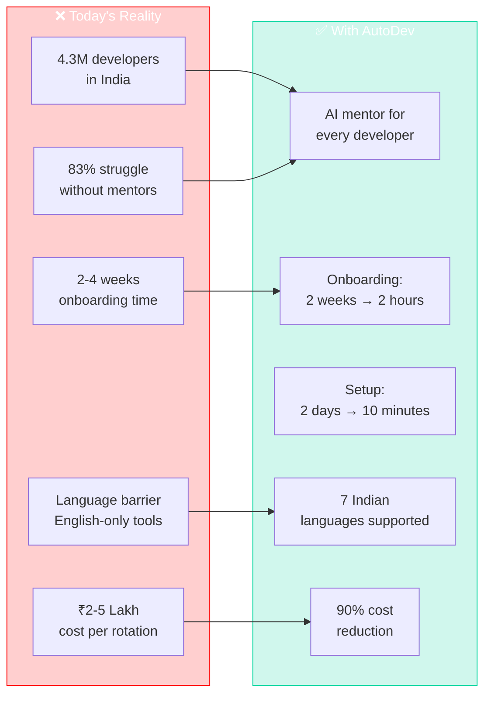

---

## 🥊 Competitive Landscape

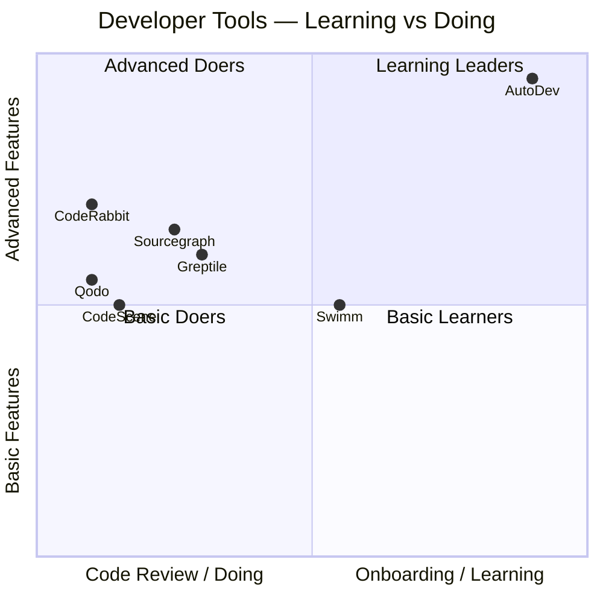

| Feature | AutoDev | CodeRabbit | Qodo | Greptile | Swimm | CodeScene |
|---|:---:|:---:|:---:|:---:|:---:|:---:|
| **Animated Visual Walkthroughs** | ✅ | ❌ | ❌ | ❌ | ❌ | ❌ |
| **Environment Setup Autopilot** | ✅ | ❌ | ❌ | ❌ | ❌ | ❌ |
| **Indian Language Support** | ✅ | ❌ | ❌ | ❌ | ❌ | ❌ |
| **Learning Progress Dashboard** | ✅ | ❌ | ❌ | ❌ | ❌ | ❌ |
| **Skill Radar Charts** | ✅ | ❌ | ❌ | ❌ | ❌ | ❌ |
| **Voice Q&A** | ✅ | ❌ | ❌ | ❌ | ❌ | ❌ |
| **AI Coding Copilot** | ✅ | Partial | Partial | Partial | ❌ | ❌ |
| **Team Leaderboard** | ✅ | ❌ | ❌ | ❌ | ❌ | ❌ |
| **VS Code Extension** | ✅ | ❌ | ✅ | ✅ | ❌ | ❌ |
| **GitHub App Integration** | ✅ | ✅ | ✅ | ✅ | ❌ | ❌ |
| **Offline Demo Mode** | ✅ | ❌ | ❌ | ❌ | ❌ | ❌ |

> **Every competitor helps developers DO work. AutoDev helps developers LEARN.**

---

## 🏗️ Infrastructure

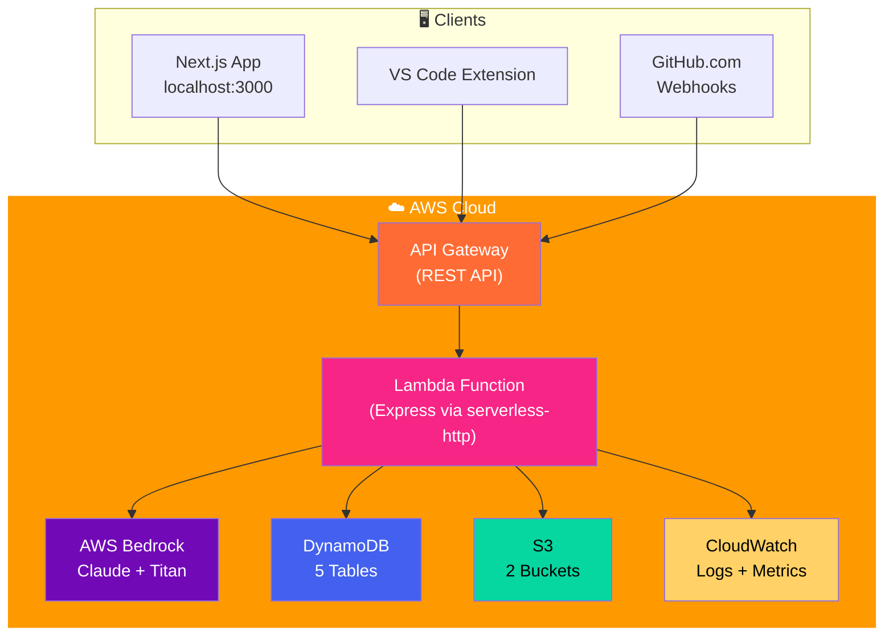

### Deployment

```bash
# Build and deploy to AWS
cd infrastructure
sam build
sam deploy --guided
```

---

## 🧑‍💻 Built With

<p>
  
  
  
  
  
  
  
  
  
  
  
  
  
  
</p>

---

## 👥 Team

Built for the **AI for Bharat Hackathon 2026** — Student Track  
**Problem Statement:** *AI for Learning & Developer Productivity*  
**Team:** HASHMAP

---

## 📄 License

MIT © Team HASHMAP
